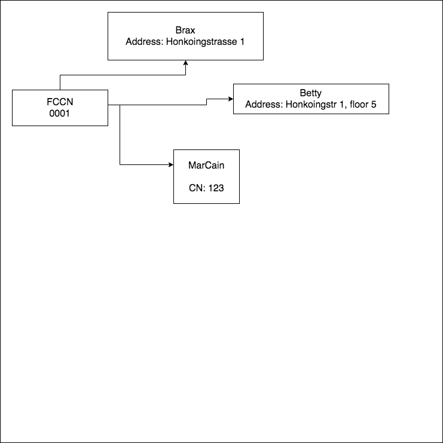

@title[fccn_what_is]

### Fashion Cloud Customer Number

* Every branch get a Fashion Cloud Customer Number (FCCN), it never changes.
* The FCCN is like the branch's id, but easier to remember.
* It is a familiar concept for the retailer.

---

@title[fccn_association]

### A FCCN maps to whatever the brand uses to identify a branch

* Customer Number
* Address
* Something else?

---

@title[fccn_models]

---

@title[fccn_advantages]

### Advantages

* The user do not have to choose among several shipping addresses that might be the same
   * Brax: Honkongstrasse 1
   * Betty: Honkongstr 1, floor 5

* Some brands might not need to share addresses, a customer number or another type of Id will be enough
    * Problem: What to show to the user? what delivery address ?

* Brands might not need to provide an address nor customer number, they may take the address that we tell them
    * We also store an address that is associated to the branch.

---

@title[shopping_cat]

### Shopping cart

Just an example of how simple can the UI be.

[Shopping Cart](https://raw.githubusercontent.com/nbaglivo/fccn/master/assets/shoppingcart.png)

---

@title[fccn_advantages_2]

### Advantages (2)

* The user won't have to deal with multiple addresses nor customer numbers.
    * Easier: Just one thing, the branch FCCN
    * FCCNs can also have aliases: 00001 => Nico's branch

* Retailers start talking about Fashion Cloud numbers, not about brands numbers, we capture them.

---

@title[fccn_advantages_3]

### Advantages (3)

If the brand hasn't provide the Address we can let the user request it.

[Shopping Cart](https://raw.githubusercontent.com/nbaglivo/fccn/master/assets/notaddress.png)
